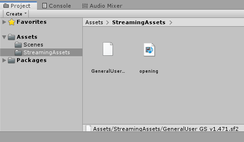
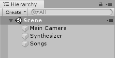
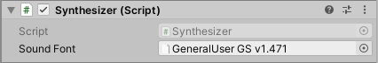
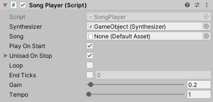
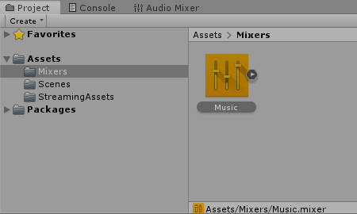
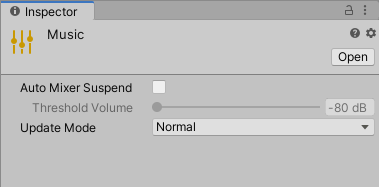
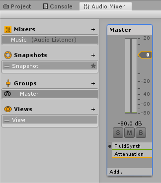
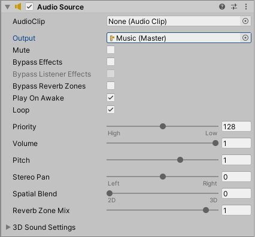
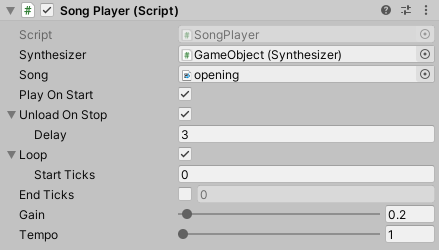

# Fluid MIDI

## Requirements

* Fluid MIDI currently only supports 64-bit Windows and Mac OS for both editor and player
* SoundFont and MIDI files can only be loaded as [streaming assets](https://docs.unity3d.com/Manual/StreamingAssets.html)

## Quick Start

### 1. Import SoundFont and MIDI files

Add all your SoundFont and MIDI files to the `StreamingAssets` folder. See the [Unity documentation](https://docs.unity3d.com/Manual/StreamingAssets.html) on streaming assets for more information.

### 2. Select host GameObjects

MIDI player components must be hosted in GameObjects. Create new ones or select existing ones. One possible setup could be to have one GameObject for the synthesizer and another GameObject for the songs. You can also just have them all in the same GameObject.

### 3. Create Synthesizer

The `Synthesizer` component loads a SoundFont, which is used by songs. Add a `Synthesizer` to your GameObject.

If a SoundFont is detected in your streaming assets, the `Synthesizer` will automatically be configured to use it. Otherwise, select the SoundFont you want to use.

### 4. Create SongPlayer

The `SongPlayer` component controls MIDI file loading and playback. Add a `SongPlayer` to your GameObject.

If a `Synthesizer` component is detected, the `SongPlayer` will be automatically configured to use it. Otherwise, select a `Syntheszier` for your `SongPlayer`. Next, select a song. This must be a MIDI file located in your streaming assets. If you want the song to start playing when the `SongPlayer` is started, select "Play On Start".

### 5. Configure Audio Mixer

Song audio is output through an [Audio Mixer](https://docs.unity3d.com/Manual/AudioMixer.html) effect. If you do not have an Audio Mixer, you can add one using the "Assets" menu by selecting "Create > Audio Mixer"

Next, select the Audio Mixer and uncheck "Auto Mixer Suspend" in the inspector.

Next, open the "Audio Mixer" panel, select the mixer, click the "Add" button, and select the "FluidSynth" effect.

### 6. Configure AudioSource

An `AudioSource` must be configured to "prime" the Audio Mixer. Add an `AudioSource` to any GameObject and ensure that it is set to "Play On Awake" and outputs to the Audio Mixer that contains the "FluidSynth" effect.

### 7. Play the Scene

If everything is configured correctly, you should now hear music playing when you start the scene. If you do not hear anything, view the console to see if any errors have been logged.

## Reference

### Synthesizer

A `Synthesizer` does not play any music on its own. It simply hosts a SoundFont, which can be used by a `SongPlayer`. When a `Synthesizer` is enabled, it will load the SoundFont, so it will be immediately ready for use. Otherwise, the SoundFont will be loaded on demand for each `SongPlayer`.

#### Inspector

* Sound Font - The SoundFont file to use for this `Synthesizer`. Must be a [streaming asset](https://docs.unity3d.com/Manual/StreamingAssets.html).

#### Scripting

`Synthesizer` extends [MonoBehaviour](https://docs.unity3d.com/ScriptReference/MonoBehaviour.html).

### SongPlayer

A `SongPlayer` is the main component that controls song loading and playback. You should have a different `SongPlayer` for each song. When a `SongPlayer` is enabled, it will load the song, so it is ready to play. When a `SongPlayer` is disabled, no song is loaded, so there may be a delay before playback can start.

#### Inspector

* Synthesizer - Reference to a `Synthesizer` in the scene. The `SongPlayer` will use the SoundFont from this `Synthesizer`.
* Song - MIDI file for this `SongPlayer`. Must be a [streaming asset](https://docs.unity3d.com/Manual/StreamingAssets.html).
* Play On Start - Play the song when the `SongPlayer` is started
* Unload On Stop - Disable this `SongPlayer` when the song finishes playing or is stopped. This effectively unloads the song from memory.
  * Delay - Seconds to wait before unloading the song. This can be useful to let some notes finish playing.
* Loop - Start playing the song again when it reaches the end
  * Start Ticks - The time at which to start playing again
* End Ticks - Specify a different end time. Consider the song complete when it reaches these ticks.
* Gain - Adjust the volume of the song
* Tempo - Adjust the song tempo by the specified multiplier

#### Scripting

`SongPlayer` extends [MonoBehaviour](https://docs.unity3d.com/ScriptReference/MonoBehaviour.html).

Property|Description
-|-
`int Ticks`|Current playback ticks. Useful for synchronizing game events to music.
`float Tempo`|Get or set the song tempo multiplier.
`bool IsReady`|True if the song has been loaded and playback can begin with minimal latency.
`bool IsPlaying`|True if the song is playing. A paused song is still considered to be playing.
`bool IsPaused`|True if the song is paused. A paused song is still considered to be playing.
`bool IsDone`|True if the song is finished playing, either becaue it was stopped or reached the end.

Method|Description
-|-
`static void PauseAll()`|Pauses all playing songs.
`static void ResumeAll()`|Resumes all paused songs.
`static void StopAll()`|Stops all playing songs.
`void Play()`|Plays the song. If the `SongPlayer` is not enabled, this method will enable it and load the song. Playback always beings from the start of the song.
`void Stop()`|Stops the song. If it was paused, it can no longer be resumed.
`void Pause()`|Pauses the song if it is playing.
`void Resume()`|Resumes the song if it is paused.
`bool Seek(int ticks)`|Moves the platyback position to the specified ticks. The song must be playing for this to work. Returns true if successful. A seek may fail if it is requested before a previous seek has completed.

## Troubleshooting

### I can't select a SoundFont in the `Synthesizer` or a MIDI file in the `SongPlayer`

* Make sure your SoundFont and MIDI files are located in the `StreamingAssets` folder. See the [Unity documentation](https://docs.unity3d.com/Manual/StreamingAssets.html) for more information on streaming assets.
* SoundFont and MIDI files are checked for validity before adding, so ensure the files are not corrupt

### I don't hear any music when I play my scene

* If you expect playback to happen without any scripting, ensure "Play On Start" is selected on the `SongPlayer`
* Make sure you have an [Audio Mixer](https://docs.unity3d.com/Manual/AudioMixer.html) configured with the 'FluidSynth' effect added
* Make sure "Auto Mixer Suspend" is not checked on your Audio Mixer
* Ensure that the GameObject hosting the `SongPlayer` is active

### I hear music in the editor but not in the player

* Ensure that you have an `AudioSource` configured with "Play on Awake" and output set to the Audio Mixer that has the "FluidSynth" effect

### Song does not play after pausing
* You must call `Resume()` to resume playing a paused song.

## Support

Please send questions or comments to [support@thunkmonkey.com](mailto:support@thunkmonkey.com)